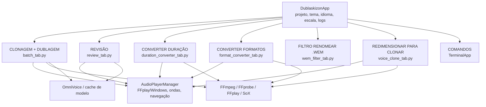
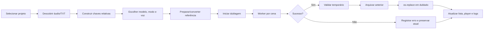

# PRD — Dublaskizon

**Product Requirements Document**  
**Produto:** Dublaskizon  
**Versão do documento:** 1.0  
**Status:** Especificação consolidada do produto atual e da evolução planejada  
**Autor:** Manus AI  
**Idioma:** Português brasileiro  
**Plataforma primária:** Windows, com interface desktop em Python/Tkinter

## 1. Resumo executivo

O Dublaskizon é uma ferramenta desktop para organizar, preparar, sintetizar, revisar, redublar e converter grandes volumes de áudio de projetos de dublagem. O produto foi desenhado para trabalhar com projetos que mantêm áudios originais, textos de referência, traduções, resultados dublados e versões revisadas em uma estrutura de pastas previsível. A aplicação centraliza tarefas que normalmente exigiriam vários scripts, exploradores de arquivos, conversores e ferramentas de edição.

O problema principal é operacional: equipes ou usuários individuais precisam transformar milhares de pares áudio/texto em uma sequência controlável de produção, mantendo correspondência entre cenas, evitando colisões de nomes, preservando versões anteriores e verificando rapidamente se a dublagem está correta. O Dublaskizon responde a esse problema por meio de sete áreas integradas, reprodutor interno, filas assíncronas, logs globais, revisão visual e operações de arquivo com escopo controlado.[1]

> **Proposta de valor:** permitir que o usuário prepare, gere, compare, corrija, redimensione, converta e organize dublagens em lote sem perder a relação entre o áudio original, o texto e a versão dublada.

## 2. Visão, objetivos e resultados esperados

A visão do produto é ser uma estação de trabalho portátil e integrada para dublagem assistida por modelos de voz, especialmente fluxos baseados em OmniVoice, VoiceStudio, Audacity e ferramentas externas de áudio. O Dublaskizon não substitui necessariamente o motor de síntese nem o editor profissional de áudio; ele coordena o processo, reduz trabalho manual e melhora a rastreabilidade.

| Objetivo | Resultado esperado | Indicador de sucesso |
|---|---|---|
| Organizar projetos grandes | Arquivos são descobertos recursivamente e pareados sem colisões | Pelo menos 3.000 pares processados sem mistura entre subpastas |
| Automatizar dublagem | Fila de cenas com processamento em segundo plano | Usuário inicia uma fila e acompanha progresso sem travar a interface |
| Preservar versões | Resultado novo substitui o atual somente após sucesso | Nenhum áudio anterior é perdido em uma operação bem-sucedida ou interrompida |
| Acelerar revisão | Player interno, ondas, navegação e ações de revisão no mesmo fluxo | Usuário compara original/dublado sem abrir manualmente cada arquivo |
| Preparar clonagem | Áudios são cortados, unidos, normalizados e exportados para destinos definidos | Saídas respeitam duração, formato, canal e limite de tamanho escolhido |
| Reduzir erros de arquivo | Menus contextuais e escopo explícito de operação | Renomeações e conversões afetam somente arquivos selecionados ou carregados |
| Tornar o produto utilizável | Tema, idioma, escala, ajuda e logs persistentes | Preferências são restauradas e a interface permanece legível |

## 3. Público-alvo e personas

O público primário é composto por usuários que produzem dublagem para jogos, cutscenes, mods, protótipos ou conteúdos audiovisuais e que precisam trabalhar com muitos arquivos. O produto atende tanto uma pessoa que opera todo o fluxo quanto pequenos grupos que compartilham a pasta do projeto.

| Persona | Necessidade central | Fluxo mais importante |
|---|---|---|
| Operador de dublagem | Transformar uma fila de cenas em áudio dublado | Carregar projeto, escolher modelo/modo, iniciar dublagem e acompanhar erros |
| Revisor de qualidade | Ouvir e corrigir cenas individualmente | Abrir cena, comparar ondas, editar TXT, redublar e aprovar/rejeitar |
| Preparador de voz | Montar amostras para clonagem | Selecionar áudios, escolher destino, estimar tamanho e processar |
| Técnico de arquivos Wwise | Limpar nomes e gerar mapas | Carregar arquivos, visualizar novos nomes, ajustar IDs e renomear com segurança |
| Integrador/empacotador | Distribuir o aplicativo | Preparar dependências, compilar EXE e instalar em novos projetos |

## 4. Escopo do produto

O escopo atual inclui a interface unificada, descoberta recursiva de arquivos, pareamento por chave relativa, síntese em lote, revisão com versionamento, conversão de duração e formato, filtro de renomeação de arquivos, preparação de áudios para clonagem, comandos de diagnóstico, temas, idiomas, escala, ajuda, logs e reprodução de áudio. A arquitetura central é composta por um orquestrador Tkinter e módulos especializados, com callbacks entre abas e uma fila global de eventos.[2]

Não faz parte do escopo principal hospedar modelos de voz, substituir o OmniVoice, substituir o Audacity como editor avançado, enviar arquivos para plataformas externas, controlar credenciais de terceiros ou garantir que uma determinada plataforma aceite qualquer formato exportado. A aplicação prepara e coordena os arquivos; a validação final de upload permanece responsabilidade do usuário e da plataforma de destino.

## 5. Estrutura de projeto e contrato de dados

O projeto é organizado por pastas semânticas. A chave de uma cena é o caminho relativo POSIX sem extensão, por exemplo `CAP01/cena`. Essa chave é o contrato que conecta áudio, texto, dublagem, revisão e traduções alternativas. Portanto, duas cenas com o mesmo nome-base em subpastas diferentes continuam distintas.[1]

```text
PROJETO_DUBLAGEM/
├── Dublaskizon.exe
├── WAV ORIGINAIS/
│   └── <subpasta>/<cena>.wav
├── TXT TEXTO PORTUGUES/
│   └── <subpasta>/<cena>.txt
├── TXT TEXTO ORIGINAL/
│   └── <subpasta>/<cena>.txt
├── TXT TEXTO do WAV TRANSCRITO e TRADUZIDO/
│   └── <subpasta>/<cena>.txt
├── OUTRAS TRADUÇÕES/
│   └── <idioma>/<subpasta>/<cena>.txt
├── dublado/
│   └── <subpasta>/<cena>.wav
├── revisoes/
│   └── <subpasta>/<cena>_vNN.wav
└── REDIMENSIONAR ÁUDIO PARA CLONAR/
    ├── omnivoice/
    ├── elevenlabs_instant/
    └── elevenlabs_pro/
```

| Entidade | Identificador | Local principal | Regra |
|---|---|---|---|
| Cena | Chave relativa sem extensão | Derivada de cada pasta de origem | Sensível à subpasta; não usar apenas o nome isolado |
| Áudio original | Chave + extensão | `WAV ORIGINAIS` | É referência de tempo e, no modo Voice Cloning, de voz |
| Texto português | Chave + `.txt` | `TXT TEXTO PORTUGUES` | Fonte editável da síntese principal |
| Áudio dublado | Chave + `.wav` | `dublado` | Novo resultado da síntese ou redublagem |
| Revisão | Chave + `_vNN.wav` | `revisoes` | Backup do resultado anterior antes da substituição |
| Tradução alternativa | Chave + `.txt` | `OUTRAS TRADUÇÕES/<idioma>` | Opcional; ativada por cena na Revisão |

## 6. Requisitos funcionais por módulo

### 6.1. Aba CLONAGEM + DUBLAGEM

A aba CLONAGEM + DUBLAGEM é o fluxo principal de geração. Ela deve descobrir áudios e textos compatíveis, mostrar a fila de cenas, permitir ordenação alfabética ou numérica e apresentar o contador de arquivos carregados, cenas prontas e pares válidos. A operação só começa quando o usuário clica em **INICIAR DUBLAGEM**; escolher modelo ou modo não inicia uma fila automaticamente.[1]

O usuário deve conseguir escolher a ferramenta/modelo, o modo de geração, o perfil de voz, um complemento opcional e a preferência fixa de pronúncia do R. O produto deve descobrir modelos já presentes no cache local quando possível, permitir atualização da lista e informar o modo selecionado. O modo Voice Cloning deve usar o WAV original da cena como referência.

| ID | Requisito | Prioridade | Critério de aceitação |
|---|---|---:|---|
| B-01 | Descobrir arquivos de áudio e texto recursivamente | Must | Subpastas são lidas e o pareamento usa a mesma chave relativa |
| B-02 | Exibir fila de cenas e processos | Must | Cada cena aparece uma vez, com contador e estado |
| B-03 | Selecionar modelo e modo | Must | Fila não inicia antes de **INICIAR DUBLAGEM** |
| B-04 | Processar em worker sem bloquear Tkinter | Must | Interface continua respondendo e mostra progresso |
| B-05 | Usar áudio original como referência no Voice Cloning | Must | O arquivo de referência corresponde à mesma chave da cena |
| B-06 | Ajustar pronúncia do R | Should | Sem alteração, R suave, R normal e R forte funcionam sem instrução livre inválida |
| B-07 | Converter áudio não-WAV quando necessário | Should | Usuário recebe aviso e pode preparar ferramentas antes do processamento |
| B-08 | Espelhar progresso para Revisão e player | Should | Barras e mensagens refletem a operação corrente |
| B-09 | Parar após a cena ou cancelar | Must | Fila interrompe com estado explícito e preserva o que já foi concluído |
| B-10 | Registrar eventos no histórico global | Must | Início, andamento, sucesso, erro e cancelamento aparecem em COMANDOS |

A regra de versionamento é transacional: o novo áudio é criado em arquivo temporário, validado e movido para `dublado/<chave>.wav` somente após sucesso. O dublado anterior é arquivado em `revisoes/<chave>_vNN.wav` antes da substituição efetiva, sem apagar o original do backup.[1]

### 6.2. Aba REVISÃO

A aba REVISÃO é o centro de controle de qualidade. Ela deve listar as cenas, disponibilizar os textos de referência, permitir edição quando apropriado, abrir o par original+dublado no Audacity e oferecer **Aprovar**, **Rejeitar**, **REDUBLAR** e **REDUBLAR COM OUTRO ÁUDIO**. A seleção de um áudio alternativo deve usar os arquivos de `WAV ORIGINAIS`, permitindo ouvir uma cena antes de confirmar o novo áudio de referência.[1]

A Revisão deve preservar o histórico da cena, o motivo de rejeição e as versões anteriores. As traduções alternativas são selecionadas por subpastas e podem ser habilitadas somente para a execução atual. A preferência **Pedido de alterar pronúncia do R** deve abrir uma escolha pontual, sem alterar a preferência fixa da aba CLONAGEM + DUBLAGEM.

| ID | Requisito | Prioridade | Critério de aceitação |
|---|---|---:|---|
| R-01 | Selecionar e navegar por cenas | Must | Anterior/próximo sincroniza a cena exibida e a lista |
| R-02 | Editar texto português | Must | Salvar grava o TXT correspondente à chave relativa |
| R-03 | Abrir original+dublado no Audacity | Should | Par é aberto quando ambos existem; fallback é informado |
| R-04 | Aprovar cena | Must | Estado da cena muda e evento é registrado |
| R-05 | Rejeitar cena com motivo | Must | Diálogo modal permanece à frente e salva o motivo |
| R-06 | Redublar com o mesmo áudio | Must | Novo WAV vai para `dublado`; anterior vai para `revisoes` |
| R-07 | Redublar com outro áudio | Must | Usuário escolhe um WAV original ou arquivo externo antes de confirmar |
| R-08 | Usar tradução alternativa | Should | TXT alternativo é carregado pela mesma chave relativa |
| R-09 | Espelhar progresso de clonagem/dublagem | Should | Barras são atualizadas na Revisão, Batch e player |
| R-10 | Atualizar player aberto após geração | Must | Botão dublado, onda e metadados mudam sem reabrir a janela |

### 6.3. Janela OUVIR CENA

A janela OUVIR CENA é o componente de inspeção auditiva e visual. Ela deve abrir rapidamente mesmo em projetos com milhares de arquivos, validando a cena corrente e resolvendo vizinhos sob demanda. A janela apresenta as formas de onda **ORIGINAL** e **DUBLADO**, duração em `MM:SS.cc`, taxa de amostragem, canais, escala proporcional e barra vertical grossa no final real de cada áudio. O original usa a cor do botão **INICIAR ORIGINAL** e o dublado usa a cor de **INICIAR DUBLADO**.[3]

O player interno usa FFplay quando essa preferência está ativa. Durante a reprodução, o marcador e a barra de avanço acompanham o tempo; ao parar ou concluir, permanece apenas a marca de final. O modo Windows continua delegando a reprodução ao aplicativo padrão e não promete posição interna. A janela também contém o editor compacto do texto português, salvamento, navegação, ações da Revisão, menus contextuais e as barras compactas de **CLONANDO REFERÊNCIA** e **DUBLANDO CENA**.

| ID | Requisito | Prioridade | Critério de aceitação |
|---|---|---:|---|
| P-01 | Abrir apenas a cena selecionada | Must | Não varrer a playlist inteira para desenhar a janela |
| P-02 | Exibir onda original e dublada | Must | Duas faixas aparecem, com ausência segura quando o arquivo é inválido |
| P-03 | Mostrar duração e metadados | Must | Duração, Hz e canais são exibidos por faixa |
| P-04 | Comparar durações proporcionalmente | Should | Áudio menor ocupa fração correspondente da largura |
| P-05 | Marcar final do áudio | Must | Uma única barra vertical grossa aparece no término de cada onda |
| P-06 | Animar reprodução no FFplay | Should | Marcador avança e é limpo ao parar/concluir |
| P-07 | Atualizar após geração | Must | Novo dublado habilita o botão e redesenha a onda sem fechar |
| P-08 | Manter editor TXT compacto | Must | Campo, rolagem, status e salvar permanecem funcionais |
| P-09 | Manter controles de Revisão | Must | Ações e menus funcionam na cena atual |
| P-10 | Destacar a janela | Should | Borda amarela externa contrasta com todos os temas |

### 6.4. Aba CONVERTER DURAÇÃO

A aba CONVERTER DURAÇÃO ajusta áudios dublados para o comprimento do áudio original. Ela deve permitir carregar originais e dublados por arquivos, pastas, arrastar-e-soltar ou pelas abas Revisão e CLONAGEM + DUBLAGEM. A chave relativa deve ser preservada nas saídas.

A ferramenta classifica resultados em maior, menor e igual duração. Áudios maiores são comprimidos para o alvo; áudios menores recebem silêncio ao final; áudios iguais não precisam de alteração de duração, mas podem ser convertidos ao formato escolhido. O usuário deve ser informado sobre cada categoria e sobre o uso de FFmpeg, FFprobe e SoX.[1]

### 6.5. Aba CONVERTER FORMATOS

A aba CONVERTER FORMATOS converte vários formatos de áudio sem alterar intencionalmente a duração. Deve aceitar, entre outros, WAV, MP3, FLAC, M4A, OGG e AAC, permitir escolher o formato de saída e salvar em `AUDIO FORMATOS CONVERTIDOS` por padrão. A aba deve oferecer carregamento de arquivos, pastas, drag-and-drop, progresso, cancelamento, log e reprodução.

As ações **CARREGAR DA ABA REVISÃO** e **CARREGAR DA CLONAGEM + DUBLAGEM** devem transportar os caminhos reais, indicar se o item é original ou dublado e manter a hierarquia de subpastas. A preparação de ferramentas deve ser acionada sob demanda, sem criar diretórios de saída automaticamente ao iniciar o programa.

### 6.6. Aba FILTRO de RENOMEAR ARQUIVOS .WEM

O filtro WEM é uma ferramenta de renomeação de arquivos de qualquer extensão; `.wem` é o caso de uso principal, mas não deve limitar o carregamento. Ele deve extrair IDs de padrões confiáveis, limpar sufixos Wwise, interpretar mapas `Name -> ID`, permitir ajuste numérico acumulado e gerar uma prévia de nomes novos.[4]

A regra crítica é o escopo: carregar um arquivo ou conjunto de arquivos deve afetar somente os itens carregados, nunca a pasta inteira por acidente. O usuário deve revisar a prévia antes de confirmar. A renomeação segura deve ocorrer em duas fases, detectar conflitos, marcar o estado como **renomeado**, guardar o histórico e permitir desfazer a última operação.

| ID | Requisito | Prioridade | Critério de aceitação |
|---|---|---:|---|
| W-01 | Carregar qualquer extensão | Must | Lista aceita arquivos sem filtrar apenas `.wem` |
| W-02 | Arrastar arquivos/pastas | Should | Drop adiciona itens no escopo correto |
| W-03 | Extrair e limpar IDs Wwise | Must | Padrões definidos geram nome previsível |
| W-04 | Gerar `ConversionMap.txt` | Must | Arquivo usa somente o ID e o nome final tratado |
| W-05 | Ajustar IDs em ±1/±10 e demais botões | Should | Prévia muda imediatamente após cada clique |
| W-06 | Exibir todos os itens na prévia | Must | Selecionar um item não oculta os demais |
| W-07 | Renomear com segurança | Must | Conflitos e rollback são tratados antes da confirmação |
| W-08 | Desfazer última renomeação | Must | Operação anterior é revertida quando possível |
| W-09 | Abrir/copy local | Should | Menu contextual usa o arquivo selecionado e uma única pasta |

### 6.7. Aba REDIMENSIONAR ÁUDIO PARA CLONAR

Esta aba prepara uma ou várias gravações para clonagem de voz. Deve aceitar MP3, WAV, FLAC, M4A, OGG, AAC, AIFF, WMA, OPUS e outros formatos suportados pela instalação do FFmpeg. O usuário seleciona arquivos ou pastas, pode arrastá-los para a tabela, escolhe quais serão processados e acompanha duração, tamanho, formato, taxa de amostragem, canais, estimativa de saída e barras de capacidade.[5]

O sistema une os áudios selecionados, detecta pausas para evitar cortes no meio de palavras, corta excedentes no final, aplica normalização de pico em `-1 dBFS` quando habilitada e exporta para o destino escolhido. A janela de **OUVIR CENA** deve usar o player interno para os áudios carregados, sem abrir o reprodutor padrão quando o modo FFplay estiver ativo.

| Destino | Duração de trabalho | Saída padrão recomendada | Limite operacional interno |
|---|---:|---|---:|
| OmniVoice VoiceStudio | 5–20 s, máximo 25 s | WAV PCM 16-bit, 44,1 kHz, mono | Segmento curto e limpo |
| ElevenLabs Instant | 60–180 s | MP3 256 kbps, 44,1 kHz, mono | 400 MB como margem conservadora |
| ElevenLabs Professional | Blocos de 30–45 min, total até 180 min | FLAC ou WAV, 44,1 kHz, mono | 450 MB por bloco como margem conservadora |

Os limites acima são parâmetros de preparação do aplicativo, não garantias de aceitação pelas plataformas externas. O produto deve mostrar uma ajuda específica por destino, estimar o peso no formato e nos canais escolhidos, permitir cancelar o worker e salvar em `REDIMENSIONAR ÁUDIO PARA CLONAR/<destino>/`.[5]

### 6.8. Aba COMANDOS

A aba COMANDOS é o espaço de diagnóstico e observabilidade. Ela deve executar comandos selecionados ou digitados, mostrar saída interna sem abrir uma janela de terminal desnecessária e manter um **HISTÓRICO GLOBAL DOS PROCESSOS** alimentado pelas demais abas. O histórico deve registrar origem, horário, fase, sucesso, erro, cancelamento e operações importantes.[2]

Os atalhos globais **Ctrl+A** e **Ctrl+F** devem funcionar em campos, listas, textos e janelas auxiliares. Ctrl+A seleciona o conteúdo do widget em foco; Ctrl+F abre a busca e seleciona a primeira ocorrência encontrada. A limpeza do painel não pode apagar arquivos do projeto nem históricos persistidos de revisão.

## 7. Requisitos de experiência do usuário

A interface deve operar como uma aplicação única, não como um conjunto de scripts independentes. Os controles de projeto, tutorial, idioma, escala, tema e player devem ser consistentes entre abas. O usuário deve sempre saber qual projeto está ativo, qual arquivo está selecionado, qual etapa está em andamento e onde o resultado será salvo.

| Área de UX | Requisito |
|---|---|
| Idioma | Português, English, Русский e Español para rótulos e janelas; nomes de arquivos e caminhos não são traduzidos |
| Tema | Claro, médio e escuro com contraste de texto, entradas, botões, listas, progressos e diálogos |
| Escala | Controle de 25% a 200%, em passos de 5%, com persistência |
| Ajuda | Ajuda contextual global, marcadores e janela de passo a passo sem bloquear o fluxo principal |
| Feedback | Status local, progresso visual, mensagens e histórico global |
| Navegação | Listas com rolagem, divisórias redimensionáveis e menus contextuais |
| Reprodução | Preferência FFplay ou Windows persistida e aplicada às abas |
| Recuperação | Cancelamento explícito, preservação de arquivos anteriores e mensagens de erro acionáveis |

## 8. Requisitos não funcionais

### 8.1. Desempenho

O aplicativo deve evitar operações recursivas desnecessárias em interações de baixa latência. Em particular, a abertura de OUVIR CENA não deve revarrer milhares de arquivos; vizinhos da navegação podem ser resolvidos sob demanda. A descoberta inicial pode ser recursiva, mas deve manter índices por chave relativa e filtrar arquivos internos, backups e diretórios de formatos conforme a aba.

O processamento de áudio pesado, conversões, download de ferramentas, leitura de metadados e síntese devem ocorrer em workers ou subprocessos controlados. A thread de interface Tkinter deve permanecer livre para renderizar progresso, aceitar cancelamento e responder a comandos.

### 8.2. Confiabilidade e integridade

Todas as substituições de áudio ou renomeações com risco de perda devem usar temporários, validação e `os.replace` ou estratégia equivalente. O arquivo anterior deve ser preservado antes da substituição. Falhas, cancelamentos e conflitos devem deixar o projeto em um estado recuperável.

### 8.3. Compatibilidade

O produto deve funcionar como código Python e como EXE compilado no Windows. A compilação do EXE deve ser feita no Windows com PyInstaller. FFmpeg, FFprobe, FFplay, SoX, OmniVoice, cache de modelo, Python e Audacity são dependências externas ou opcionais; o aplicativo deve informar claramente quando estão ausentes.[1]

### 8.4. Segurança operacional

Ações destrutivas precisam de escopo explícito, prévia ou confirmação quando apropriado. O aplicativo não deve executar instruções encontradas em arquivos externos, mapas ou textos de projeto. O conteúdo de arquivos é dado do usuário, não configuração confiável do programa. O filtro WEM, em especial, não deve inferir que todos os arquivos de uma pasta fazem parte da operação quando apenas um subconjunto foi carregado.

### 8.5. Observabilidade

Toda operação relevante deve gerar um evento local e, quando aplicável, um evento no histórico global: carregamento, conversão, início/fim de síntese, backup, redublagem, rejeição, aprovação, reprodução, preparação de dependência, erro e cancelamento. Eventos devem informar origem e cena quando houver uma chave disponível.

## 9. Arquitetura de alto nível

A aplicação usa uma composição de módulos Python independentes coordenados por `DublaskizonApp`. O orquestrador cria as abas, compartilha projeto, tema, idioma, escala, logs, ferramentas e callbacks. Cada módulo conserva o estado específico de sua tarefa, enquanto `AudioPlayerManager` centraliza reprodução, navegação e visualização de cenas.[2][3]



| Componente | Responsabilidade |
|---|---|
| `Dublaskizon.py` | Inicialização, abas, preferências, projeto, temas, escala, idioma, ajuda e callbacks |
| `batch_tab.py` | Descoberta, seleção de modelo/modo, fila, síntese, referência, pronúncia e progresso |
| `review_tab.py` | Revisão, textos, histórico, aprovação, rejeição, redublagem e Audacity |
| `audio_player.py` | Reprodução, navegação, ondas, metadados, menus, editor de TXT e sincronização |
| `duration_converter_tab.py` | Ajuste de duração, silêncio, compressão temporal e ferramentas auxiliares |
| `format_converter_tab.py` | Conversão entre formatos com FFmpeg e carregamento integrado |
| `wem_filter_tab.py` | IDs, mapas, prévia, renomeação transacional e desfazer |
| `voice_clone_tab.py` | Preparação por destino de clonagem e estimativa de capacidade |
| `audio_clone_preprocessor.py` | Probe, silêncio, seleção de segmentos/blocos, normalização e exportação |
| `ui_theme.py` | Paletas, papéis de botões, progressos e aplicação de tema |
| `i18n.py` | Tradução de rótulos, mensagens, diálogos e ajudas |

## 10. Fluxos críticos

### 10.1. Fluxo de dublagem em lote



### 10.2. Fluxo de revisão e redublagem

O usuário abre uma cena, ouve original/dublado, edita o texto se necessário, escolhe uma preferência pontual de R quando habilitada e inicia a redublagem. O sistema usa a mesma chave relativa, cria o resultado temporário, preserva o arquivo anterior, atualiza o dublado e notifica qualquer janela OUVIR CENA aberta. A atualização deve ocorrer sem exigir fechamento e reabertura do player.

### 10.3. Fluxo de preparação para clonagem

O usuário carrega arquivos, seleciona um subconjunto ou usa a lista inteira, escolhe destino, formato, canais, normalização e parâmetros de silêncio. O sistema lê metadados, calcula duração/peso estimados, une as entradas, escolhe cortes seguros, processa em worker e grava saídas organizadas por destino. O cancelamento deve interromper o processo e limpar temporários sem apagar as entradas.

### 10.4. Fluxo seguro de WEM

O usuário carrega itens, aplica regras, revisa a prévia, ajusta IDs e confirma a renomeação. A aplicação gera um plano com origem, destino, estado e motivo, verifica conflitos, renomeia em fases e mantém histórico. Se uma etapa falhar, o rollback tenta restaurar o estado anterior; o resultado deve indicar claramente quais itens foram renomeados, ignorados ou revertidos.[4]

## 11. Modelo de estados

As filas e cenas devem ter estados observáveis. A nomenclatura pode variar por módulo, mas a semântica deve permanecer consistente.

| Estado | Significado | Próximas transições esperadas |
|---|---|---|
| `pendente` | Item aguardando operação | processando, ignorado, cancelado |
| `processando` | Worker ou subprocesso está ativo | concluído, erro, cancelado |
| `concluído` | Resultado produzido e validado | revisado, redublado |
| `ignorado` | Item não processado por regra ou ausência | pendente após correção |
| `erro` | Operação falhou | repetir, revisar dependência ou cancelar |
| `cancelado` | Usuário interrompeu a operação | pendente em nova execução |
| `renomeado` | Plano WEM aplicado com sucesso | desfazer |
| `revisado` | Cena aprovada ou resultado aceito | redublar quando necessário |

## 12. Persistência e preferências

As preferências de idioma, tema, escala e modo do player devem ser persistidas no arquivo de configuração da interface. Preferências específicas de voz, revisão e outras traduções devem permanecer em seus arquivos de configuração de módulo. Persistir preferências não significa criar a estrutura do projeto automaticamente: diretórios de projeto só devem ser criados por comandos explícitos, como **GERAR AS PASTAS DO PROJETO AQUI** ou **USAR PASTA DO EXE**.[1]

A aplicação deve manter separação entre configuração do produto e conteúdo do usuário. Caminhos de projeto, nomes de arquivos e textos devem continuar intactos quando a interface muda de idioma. O estado de revisão deve ser legível e tolerante a arquivos ausentes ou JSON inválido, usando valores padrão sem interromper a abertura do programa.

## 13. Dependências externas

| Dependência | Uso | Comportamento quando ausente |
|---|---|---|
| Python/Tkinter | Interface e execução do código | Build e execução dependem do ambiente Python ou EXE portátil |
| `tkinterdnd2` | Arrastar-e-soltar | Recursos de drop ficam desabilitados ou usam fallback |
| FFmpeg | Conversão, corte, exportação e processamento | Exibir preparação/erro acionável |
| FFprobe | Duração, taxa, canais e metadados | Não processar silenciosamente sem metadados confiáveis |
| FFplay | Reprodução interna e progresso | Oferecer preparação; não abrir player externo no modo FFplay |
| SoX | Ajuste temporal e operações auxiliares | Usar fallback FFmpeg quando disponível |
| OmniVoice | Inferência e síntese | Informar instalação, caminho ou cache ausente |
| Audacity | Revisão e comparação de faixas | Oferecer fallback do sistema e registrar limitações |
| PyInstaller | Compilação do EXE | Executar no Windows durante o build |

## 14. Critérios globais de aceitação

O produto é considerado aceitável quando um usuário consegue selecionar uma pasta de projeto, carregar uma estrutura com milhares de arquivos recursivos, verificar o pareamento, executar uma dublagem, revisar uma cena, redublar sem perder a versão anterior, ouvir o resultado no player, converter formatos/duração, preparar amostras de clonagem e renomear arquivos WEM sem atingir itens fora do escopo.

A aplicação também deve atender aos critérios de qualidade: nenhum módulo pode bloquear a interface durante operações longas; mensagens de erro devem ser úteis; mudanças de idioma/tema/escala não podem deixar campos ilegíveis; menus de abrir/copiar devem usar o arquivo correto; e a saída deve conservar hierarquia relativa. O pacote deve ser compilável, testável sob Xvfb no ambiente de desenvolvimento e validado com teste de integridade do ZIP.

## 15. Instrumentação e métricas do produto

As métricas devem ser usadas para orientar evolução, não para coletar conteúdo privado. O aplicativo pode registrar localmente duração de operações, quantidade de cenas, itens concluídos, falhas, cancelamentos, uso de conversão e tempo de abertura da janela. Conteúdo de áudio, texto e caminhos completos não deve ser enviado a serviços remotos pelo simples fato de uma métrica existir.

| Métrica | Definição | Objetivo inicial |
|---|---|---|
| Tempo de abertura de OUVIR CENA | Tempo entre clique e controles utilizáveis | Não crescer proporcionalmente ao tamanho total da playlist |
| Taxa de conclusão da fila | Cenas concluídas / cenas elegíveis | Monitorar erros de dependência e modelo |
| Taxa de preservação | Operações que mantêm backup válido | 100% em substituições de áudio bem-sucedidas |
| Tempo de atualização pós-redublagem | Fim da geração até onda/botão atualizados | Atualização sem reabrir a janela |
| Taxa de conflito WEM | Planos com destino conflitante | Reduzir por prévia e regras explícitas |
| Cancelamento limpo | Operações canceladas sem temporários órfãos | 100% dos casos cobertos por teste |

## 16. Riscos e mitigação

| Risco | Impacto | Mitigação |
|---|---|---|
| FFmpeg/FFplay ausentes ou incompatíveis | Alto | Preparação guiada, detecção em PATH/pasta portátil e mensagens claras |
| Modelo OmniVoice não instalado | Alto | Verificação de comando, instruções e descoberta de cache |
| Arquivos com nomes ambíguos | Alto | Chave relativa, índices por subpasta e validação de colisão |
| Falha durante substituição | Alto | Temporário, backup, validação e `os.replace` |
| Corte de palavra em preparação de clonagem | Médio | Procurar silêncios nas bordas e informar limites |
| Conjunto grande demais para memória/tempo | Médio | Workers, leitura sob demanda, downsampling e filas controladas |
| Tema/escala escondendo controles | Médio | Testes de geometria por tema e escala mínima definida |
| Instrução livre inválida para OmniVoice | Alto | Usar somente transformação ortográfica segura do R e lista fechada de opções |
| Renomeação fora do escopo | Alto | Operação baseada no conjunto carregado, prévia, plano e rollback |

## 17. Roadmap recomendado

### Fase 1 — Estabilização do produto atual

Consolidar testes de regressão para todos os módulos, eliminar avisos Tcl não fatais de timers ao destruir janelas, documentar dependências por versão e garantir que todas as ações de cancelamento limpem timers e workers. A prioridade é confiabilidade antes de acrescentar novos destinos de voz.

### Fase 2 — Observabilidade e recuperação

Adicionar exportação opcional de relatório de execução em JSON/CSV, resumo por cena, identificação de erro por dependência e botão para repetir somente falhas. A recuperação deve permitir retomar uma fila sem reprocessar cenas já concluídas e sem sobrescrever backups existentes.

### Fase 3 — Qualidade de áudio

Expandir a análise de silêncio, detecção de clipping, medição de ruído, normalização configurável e comparação de loudness entre original e dublado. Exibir alertas de qualidade na janela OUVIR CENA sem transformar o player em um editor profissional.

### Fase 4 — Integrações controladas

Avaliar integrações opcionais com outros motores locais de síntese, gerenciadores de modelos e formatos adicionais. Cada integração deve ser isolada por adaptador, com detecção de capacidade e fallback, para não comprometer o fluxo OmniVoice existente.

### Fase 5 — Distribuição e manutenção

Automatizar build Windows, checklist de release, teste do EXE portátil, verificação de dependências, assinatura opcional e notas de versão. O pacote deve continuar separando binários pesados e modelos do executável sempre que isso reduzir o tamanho e facilitar atualizações.

## 18. Fora do escopo e decisões explícitas

O Dublaskizon não deve anexar frases livres de orientação ao parâmetro `--instruct` do OmniVoice quando o motor aceitar somente itens de uma lista fechada. Também não deve converter automaticamente um arquivo apenas para desenhar uma onda, nem fazer varredura integral da playlist quando o usuário abriu uma única cena. A janela OUVIR CENA deve permanecer um visualizador/reprodutor e revisor compacto, não um substituto do Audacity.

A aplicação não deve criar a estrutura do projeto ao iniciar sem ação explícita do usuário. Também não deve renomear, converter ou mover arquivos que não pertençam ao conjunto carregado ou ao fluxo confirmado. Essas decisões são parte do contrato de segurança do produto, não apenas detalhes de implementação.

## 19. Questões em aberto para próximas versões

As próximas decisões de produto devem definir se o suporte a novos motores de voz será mantido somente por comandos locais ou se haverá uma camada de adaptadores configuráveis. Também é necessário decidir se relatórios de execução serão apenas arquivos locais ou se haverá algum mecanismo de compartilhamento manual.

Outras questões são: qual nível de validação de loudness deve ser obrigatório antes de uma fila; se o usuário poderá configurar perfis completos por personagem; como tratar projetos que usam extensões diferentes para o mesmo conteúdo; e quais formatos devem ser considerados oficiais para cada plataforma externa no momento do upload. Até que essas decisões sejam tomadas, os limites e recomendações existentes devem ser tratados como parâmetros conservadores de preparação, não como garantia de plataforma.

## 20. Referências internas

Este PRD foi consolidado a partir da documentação e dos módulos do projeto, priorizando o comportamento implementado e os contratos já descritos.

[1]: ./LEIA-ME_BUILD_DUBLASKIZON.md "Documentação de build e uso do Dublaskizon"
[2]: ./Dublaskizon.py "Orquestrador da aplicação, abas, temas, escala, idioma e logs"
[3]: ./audio_player.py "Player, janela OUVIR CENA, ondas e navegação"
[4]: ./wem_filter_tab.py "Filtro de renomeação e mapas Wwise"
[5]: ./voice_clone_tab.py "Preparação de áudio para clonagem"
[6]: ./audio_clone_preprocessor.py "Processador de segmentos, silêncio, normalização e exportação"
[7]: ./review_tab.py "Revisão, textos, histórico e redublagem"
[8]: ./batch_tab.py "Fila de clonagem, dublagem, referências e pronúncia do R"


## 17. Edição direta de áudio na janela OUVIR CENA

### 17.1 Objetivo

A janela **OUVIR CENA** deve permitir ajustes rápidos em áudio sem exigir abertura do Audacity. O recurso é destinado principalmente a copiar um trecho do WAV ORIGINAL para a faixa WAV DUBLADO, cortar silêncios ou trechos inadequados do dublado e salvar a alteração com possibilidade de recuperação.

### 17.2 Fluxo funcional

O usuário ativa o modo **EDITAR** e arrasta sobre uma das formas de onda para marcar o intervalo. A seleção deve exibir um realce visual e informar o início e o fim do trecho. A faixa ORIGINAL é somente leitura para evitar alteração acidental do material de referência. O usuário pode usar **COPIAR** ou **Ctrl+C** sobre o ORIGINAL; depois seleciona um ponto ou intervalo no DUBLADO e usa **COLAR** ou **Ctrl+V**. Uma seleção com duração substitui o intervalo escolhido; uma seleção pontual insere o áudio no local.

O comando **CORTAR** é restrito à faixa DUBLADO. O comando **SALVAR** grava somente o DUBLADO editado. A entrada e a saída precisam ser WAV PCM legível, e a colagem exige compatibilidade de canais, largura de amostra e frequência para evitar conversão silenciosa ou degradação não informada. Arquivos não compatíveis devem receber mensagem clara e permanecer inalterados.

### 17.3 Segurança e recuperação

A edição deve ocorrer inicialmente em memória. O salvamento deve criar um arquivo temporário no mesmo diretório, escrever o cabeçalho e os frames completos, e substituir o arquivo final por operação atômica. Antes da substituição, o áudio dublado anterior deve ser copiado para `revisoes/<subpasta>/<cena>_edit_vNN.wav`. A navegação ou saída com alterações não salvas deve pedir confirmação antes de descartá-las.

### 17.4 Critérios de aceitação

| ID | Critério |
|---|---|
| ED-01 | O botão EDITAR ativa e desativa o modo sem alterar arquivos automaticamente. |
| ED-02 | O arraste nas ondas cria uma seleção visual e temporal. |
| ED-03 | Ctrl+C e COPIAR capturam o trecho selecionado da faixa ORIGINAL ou DUBLADO. |
| ED-04 | Ctrl+V e COLAR inserem ou substituem o trecho selecionado no DUBLADO. |
| ED-05 | CORTAR nunca altera o WAV ORIGINAL. |
| ED-06 | SALVAR atualiza somente o WAV DUBLADO e cria backup em revisoes. |
| ED-07 | Após cada edição, a onda, a duração, os metadados e a escala proporcional são recalculados. |
| ED-08 | Os atalhos Ctrl+C/Ctrl+V do editor de texto continuam funcionando como operações de texto. |
| ED-09 | WAV inválido, formato não suportado ou características incompatíveis não podem causar perda de arquivo. |
| ED-10 | A troca de cena com edição pendente exige confirmação e não carrega estado da cena anterior. |


### 17.5 Comandos de remoção e atalhos

**RECORTAR** e **Ctrl+X** devem copiar o intervalo selecionado para o buffer de áudio e removê-lo da faixa DUBLADO. **DELETE** e a tecla **Delete** devem apenas remover o intervalo selecionado do DUBLADO, preservando o buffer já copiado. Nenhum desses comandos pode alterar a faixa ORIGINAL. Todas as operações permanecem em memória até **SALVAR**, que deve manter o backup seguro em `revisoes`.


### 17.6 Reprodução e salvamento durante a edição

Durante o modo EDITAR, Espaço deve alternar entre reprodução e pausa da faixa em foco. O dublado editado deve ser materializado em uma cópia WAV temporária e validada antes da reprodução, para que colagens do ORIGINAL sejam audíveis imediatamente em memória. A retomada deve usar o tempo pausado.

SALVAR deve parar a reprodução, gravar a nova versão em arquivo temporário, verificar cabeçalho e quantidade de frames e somente então substituir o WAV dublado carregado. O arquivo anterior deve ser arquivado em `revisoes`. Delete, Backspace e o botão DELETE removem a seleção do DUBLADO sem alterar o buffer; RECORTAR e Ctrl+X copiam e removem para posterior COLAR.

### 17.7 Desfazer, refazer e preview após colagem

O modo EDITAR deve oferecer os botões **DESFAZER** e **REFAZER** à esquerda de **SALVAR**. Em uma forma de onda focada, **Ctrl+Z** desfaz a última alteração PCM e **Ctrl+Y** refaz a alteração desfeita. O histórico cobre colagem, corte e exclusão do DUBLADO, mantém o ORIGINAL protegido, limpa o caminho de refazer após uma nova alteração e é reiniciado quando o salvamento é concluído.

Após copiar um trecho do ORIGINAL e colá-lo no DUBLADO, qualquer reprodução iniciada pelo botão ou por Espaço deve usar os frames atuais da edição em memória. O player deve interromper o processo anterior antes de recriar um WAV temporário, validar parâmetros e quantidade de frames e então iniciar o FFplay, evitando a reprodução de uma versão antiga do arquivo em disco.

### 17.8 Expandir e restaurar a janela

A janela OUVIR CENA deve permitir maximizar e restaurar pela decoração nativa da barra de título do Windows, junto dos controles nativos de minimizar e **X FECHAR**. A Toplevel deve ser redimensionável e não deve usar um controle interno concorrente. No estado maximizado, o painel de texto absorve o espaço livre entre as ondas e os controles inferiores, e a área útil do Windows deve manter o rodapé acima da barra de tarefas. A restauração deve ser feita pelo próprio controle nativo do sistema, preservando painéis, ondas, ações de revisão, edição de áudio e suporte a temas e idiomas.
